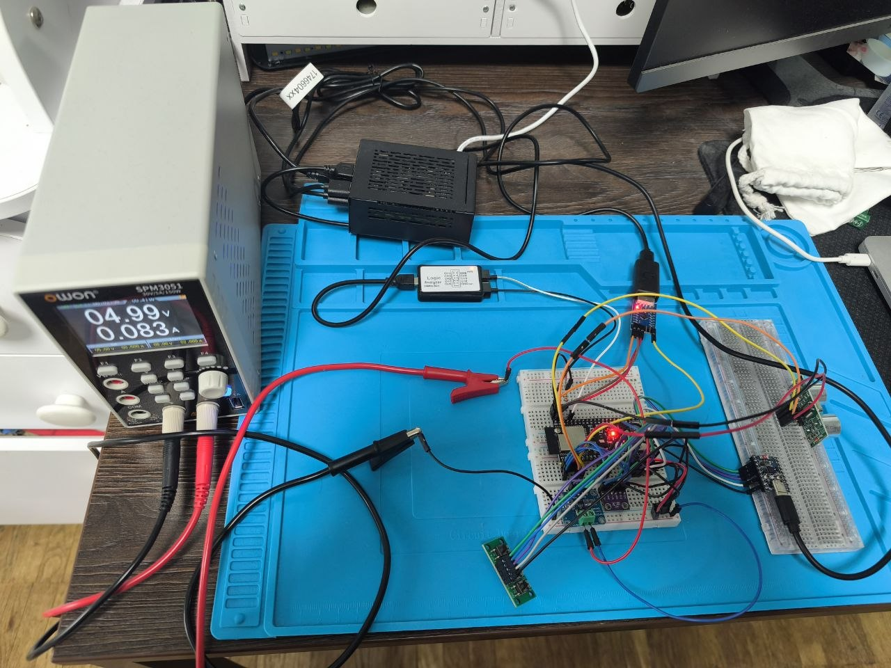
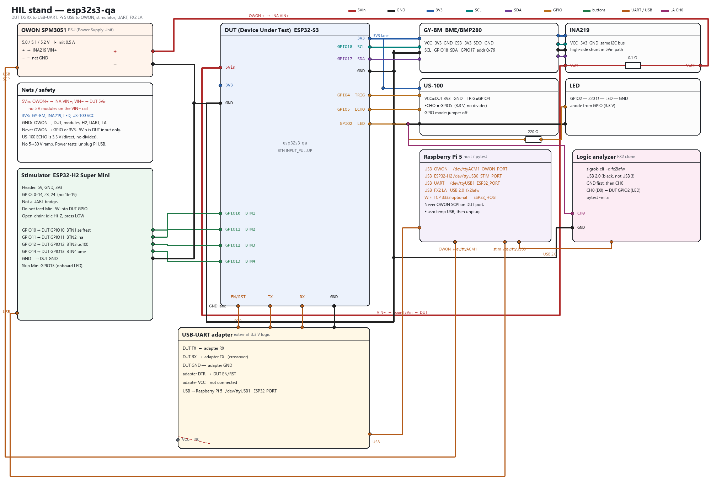
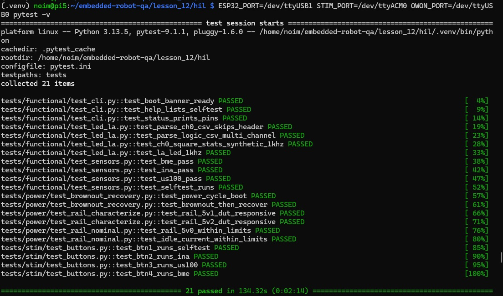

# Home HIL (Hardware-in-the-Loop) stand demo

Real bench built at home: Raspberry Pi 5 orchestrator, ESP32-S3 DUT (Device Under Test),
ESP32-H2 button stimulator, OWON PSU (Power Supply Unit) on the 5 V rail, INA219, US-100, GY-BM, and an FX2 logic analyzer.

This repo is the firmware, wiring, and pytest suite used on that stand — not a course hand-in.

Example pytest run log: [`docs/pytest.log`](docs/pytest.log)

- Wiring: [`WIRING.md`](WIRING.md)
- PRD: [`PRD.md`](PRD.md)
- Traceability matrix: [`hil/traceability_matrix.md`](hil/traceability_matrix.md)
- DUT firmware: [`dut_esp32s3/`](dut_esp32s3/)
- Button stimulator: [`stim_esp32/`](stim_esp32/)
- Pytest HIL: [`hil/`](hil/)
